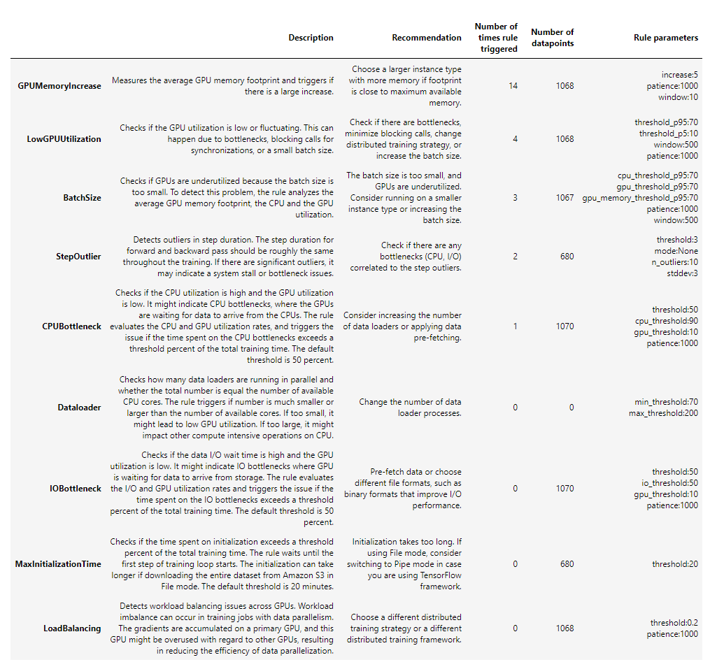
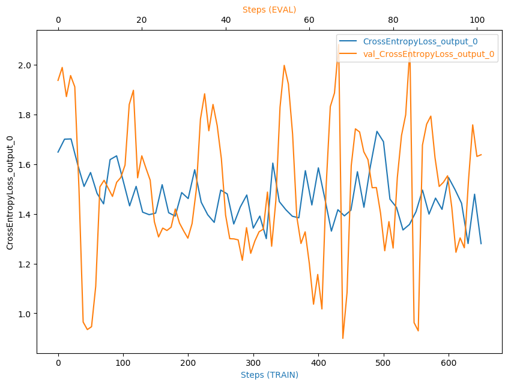

# Inventory Monitoring at Distribution Centers

### Counting objects from the bin-images
In this project, we will build, train and deploy a deep learning model for image classification to count the number of objects from [Amazon Bin Image Dataset](https://registry.opendata.aws/amazon-bin-imagery/), which contains over 500,000 images and metadata from bins of a pod in an operating Amazon Fulfillment Center,  by using AWS Sagemaker. 

## Project Set Up and Installation
1. Clone this repo in AWS Sagemaker Instance or Sagemaker Studio
2. Set the instance type as `ml.t3.medium` instance
3. run the notebook `sagemaker.ipynb`

## Dataset

### Overview
The dataset we currently use is sourced from the [Amazon Bin Image Dataset](https://registry.opendata.aws/amazon-bin-imagery/), which contains over 500,000 images and metadata from bins of a pod in an operating Amazon Fulfillment Center. In this project, Udacity provides 10.4K images with a json metadata file which contains upto 5 objects in the bins. We will create a folder called train_data, and download training data and arranges it in subfolders according to the json file provided by Udacity. Each of these subfolders contain images where the number of objects is equal to the name of the folder. For instance, all images in folder 1 has images with 1 object in them. Finally, we will divide the train_data into training, test and validation sets.

### Access
If you want to choose the subset provided in `file_list.json`, you need to clone this repo and execute the notebook `sagemaker.ipynb`. If not, you can feel free to access the open source data from [Amazon Bin Image Dataset](https://registry.opendata.aws/amazon-bin-imagery/).

## Model Training
Our dataset only accounts for 2% of the total data in the  [Amazon Bin Image Dataset](https://registry.opendata.aws/amazon-bin-imagery/). We split them into train, test and validation dataset with 80-10-10.
we use the pre-trained model Resnet50 to train our image classification model to identify the number of objects inside the bin. Resnet50 is a commonly used CNN model in computer vision application, which won the 1st place on the ILSVRC 2015 classification task.

- Training Job in Sagemaker

For the initiate training which is implemented by PyTorch built in sagemaker with "ml.g4dn.12xlarge" instance, we set up the following parameters for the training job :
```
    "batch_size": 64,
    "num_classes": 5,
    "lr": 0.01,
    "epochs": 2,
```

The initial accuracy for the testing data during training based on the above parameter 30.72%.

- Hyperparameter Tuning
Amazon Sagemaker supports to look for the best model automatically by focusing on the most promising combinations of hyperparameter values within the ranges that we specify.  To get good results, we need to choose the right ranges to explore. We select lr and batch_size as the hyperparameters:
```
hyperparameter_ranges = {
    "lr": ContinuousParameter(0.001, 0.1),
    "batch_size": CategoricalParameter([32, 64, 128]),
}
```
Sagemaker also support to define an objective metric for the tuning job to check the best ones. In this tuning job, we define the metric definition as below:
```
objective_metric_name = "average test loss"
objective_type = "Minimize"
metric_definitions = [{"Name": "average test loss", "Regex": "Testing Loss: ([0-9\\.]+)"}]
```

The minimum test loss will be the basis for finding the best parameters. The *best hyperparameters* are:
```
 'batch_size': '64',
 'lr': '0.0018788785870785117',
```
Note that the instance for the tuning job is `ml.g4dn.12xlarge` to accelerate the hyperparameter tuning task. But for the cost saving, we could use `ml.g4dn.xlarge` 


- Debugging/Profiling Job 

After getting the best hyperparameters with hyperparameter tuning, we will use model debugging and profiling to better monitor and debug the model training job.

SageMaker Debugger auto generated a SageMaker Debugger Profiling Report for the training jobs. The report provides summary of training job, system resource usage statistics, framework metrics, rules summary, and detailed analysis from each rule. To implement Sagemaker Debugger/Profiler, we need to add hooks to train and test the model after importing necessary libraries. Creating hook and registering the model will give us ability to select rules such as overfit, poor_weight_initialization, and profiler_report. 


The Debugger Framework metrics summary shows the time spent on the TRAIN phase, the EVAL phase, and others. Our training job spent quite a significant amount of time (67.62%) in phase "others". The main reason is that it takes more time to download the data from S3 and to download the ResNet50 model.



Rule Summary shows a profiling summary of the Debugger built-in rules. The table is sorted by the rules that triggered the most frequently. During our training job, the GPUMemoryIncrease rule was the most frequently triggered. It processed 1068 datapoints and was triggered 14 times. Hence we can consider choosing a larger instance with more memory. The 2nd LowGPUUtilization shows our training job is underutilizing the instance(`ml.g4dn.12xlarge`). We may want to consider to either switch to a smaller instance type or to increase the batch size.



 I set save_interval up as 10 steps interval for training and 1 for validation as we want to record more data. We see that the cross-entropy loss in the validation set fluctuates widely, which may be related to the large difference between the images in the validation set and the training set.

- Deployment

The deployment of this project is mainly implemented through Sagemaker's endpoint service. After training and evaluating and tuning the best model, we need to write a separate script inference.py to achieve successful deployment of endpoint, in which we need to implement the net, model_fn, input_fn and predict_fn functions. In addition to this, we need to define predictor_cls, which is a function to call to create a predictor. Our ImagePredictor class will collect endpoint name, serializer, deserializer and also Sagemaker session. We use the PyTorchModel in Sagemaker to create a SageMaker PyTorchModel object that can be deployed to an Endpoint and then invoke deploy method to create an endpoint in Sagemaker.

```

def net(num_classes=5):
    # load the pre-trained model - resnet50
    model = models.resnet50(pretrained=True)
    # freeze part of  model except the last linear layer 
    for param in model.parameters():
        param.requires_grad = False  
    # input size for last linear layer
    num_features = model.fc.in_features
    # update the last linear layer
    model.fc = nn.Linear(num_features, num_classes)
    
    return model
    
def model_fn(model_dir):
    model = net()
    model_path = os.path.join(model_dir, 'model.pth')
    device = torch.device("cuda") if torch.cuda.is_available() else torch.device("cpu")
    if (device == torch.device("cpu")) or (device=="cpu"):
                model.load_state_dict(
            torch.load(model_path, map_location=torch.device('cpu')))
    else:
        model.load_state_dict(
            torch.load(model_path))

    # with open(os.path.join(model_dir, "model.bin"), "rb") as f:
    #     model.load_state_dict(torch.load(f))
    logger.info('Successfully loaded the model')
    return model.to(device)

def input_fn(request_body, content_type='image/jpeg'):
    logger.info('Deserializing the input data.')
    # process an image uploaded to the endpoint

    logger.debug(f'Request body CONTENT-TYPE is: {content_type}')
    logger.debug(f'Request body TYPE is: {type(request_body)}')
    
    if content_type == 'image/jpeg': 
        return Image.open(io.BytesIO(request_body))
    
    elif content_type == 'application/json':
        #img_request = requests.get(url)
        logger.debug(f'Request body is: {request_body}')
        request = json.loads(request_body)
        logger.debug(f'Loaded JSON object: {request}')
        url = request['url']
        img_content = requests.get(url).content
        return Image.open(io.BytesIO(img_content))
    else:
        raise Exception('Requested unsupported ContentType in content_type: {}'.format(content_type))

# inference
def predict_fn(input_object, model):
    
    logger.info('In predict fn')
    transform = transforms.Compose([
        transforms.Resize((224, 224)),
        transforms.ToTensor(),
        transforms.Normalize(mean=(0,0,0), std=(1,1,1))
    ])

    logger.info("transforming input")
    input_object=transform(input_object)
    device = torch.device("cuda") if torch.cuda.is_available() else torch.device("cpu")
    input_object = input_object.to(device)
    with torch.no_grad():
        logger.info("Calling model")
        prediction = model(input_object.unsqueeze(0))
    return prediction
```

- Evaluation

  | Model                | Testing Loss | Accuracy |
  | -------------------- | ------------ | -------- |
  | Benchmark            | NA           | 55.67%   |
  | No-tuned             | 1.5271       | 30.72%   |
  | Hyperparameter Tuned | 1.4786       | 31.58%   |


## Machine Learning Pipeline

1. *Data Acquiring and Preparation*
    1. Downloading from [Amazon Bin Image Dataset](https://registry.opendata.aws/amazon-bin-imagery/)
    
    2. Splitting them into train, test and validation
    3. Uploading divided data to S3 bucket 
    
2. *Training Model*
    Train with the pre-trained model, Resnet50.

3. *Hyperparameter Tuning*

    Below two hyperparameters are considered:

    1. learning rate
    2. batch_size

4. *Model Evaluation*

    Check out the accuracy for the best model and compare with the benchmark.

5. *Model Deployment*

    Predict images by invoking the inference endpoint.

## Script Files used
`hpo.py` for hyperparameter tuning jobs where we train the model for multiple time with different hyperparameters and search for the best one based on loss metrics.

`train.py` for training only.


`finetuner-debugger.py` for really training the model with the best parameters getting from the previous tuning jobs, and put debug and profiler hooks for debugging purpose.


`inference.py` to using the trained model as inference and serializing the data before it passes to the endpoint for prediction.


`sagemakery.ipynb` is a submission script that can create Hyperparameter Tuning job, Training job and Endpoints.


`proposal.pdf` is a proposal for pre-requisite *Capstone Proposal* project whose review can be see [here]( https://review.udacity.com/#!/reviews/3865533)


`project report.pdf`: The document for the Capstone project.